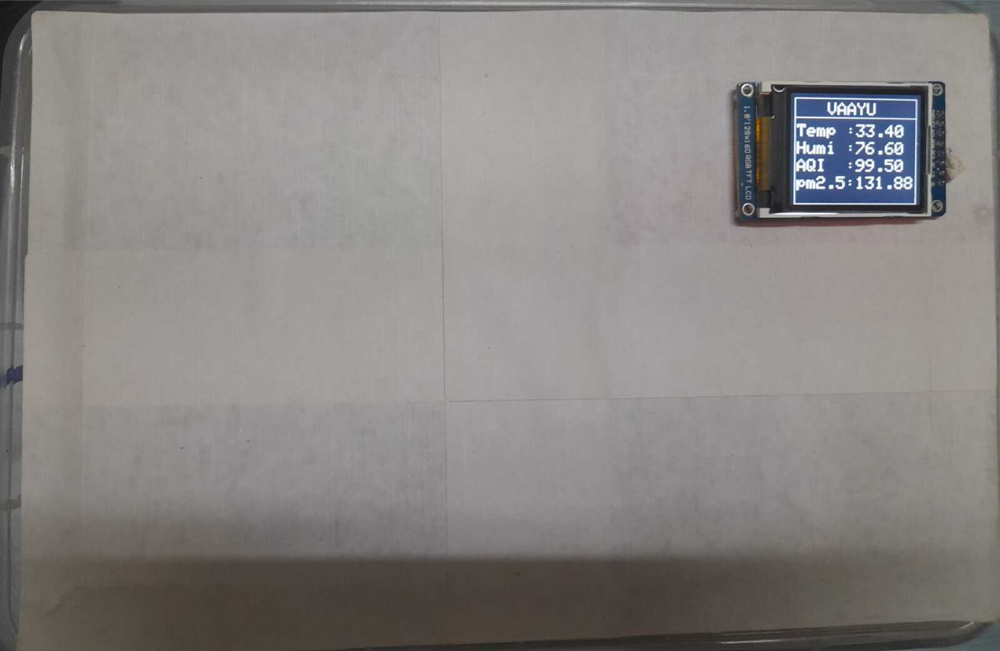

# VAAYU (Virtual air assesment yeild utilit)

Brief :- 
-- 
Open source IOT and embedded system based product solution for Air quality and alert system.

Device contains the On board Display to present Real-time data on screen. power adapter to use in household,workshops and factories.  

This repository contains the mechanical design, Electronics Hardware and firmware files of VAAYU.

Specification:- 
-- 

* On Board micro-controller
* Sensors 
    * MQ-2 - smoke
    * MQ-8 - Hydrogen Gas
    * MQ135 - AQI, CO2, toluene, NH4 ,acetone 
    * MQ138 - Formaldehyde gas
    * GP2Y1010 sensor - pm2.5 partical sensor
    * DHT11 - Temperature and Humidity

* Display 
* Buzzer 
* Alert LED's
* Power circuit 

key-components:-  
--
* Microcontroller with good Operating frequency and no. required pins.
* sensors as above
* wifi/ble capabilities with esp32 
* TFT display GUI
* GUI for Real-time readings 

Output:- 
-- 

Readings on Terminal :- 

Readings in CSV file :- 

Readings Serially importing :- 

Readings on GUI (Grapgical user interface) :- 

Architecture of VAAYU :-
--

Internal-circuit of VAAYU :- 
--

Product VAAYU :-
--

